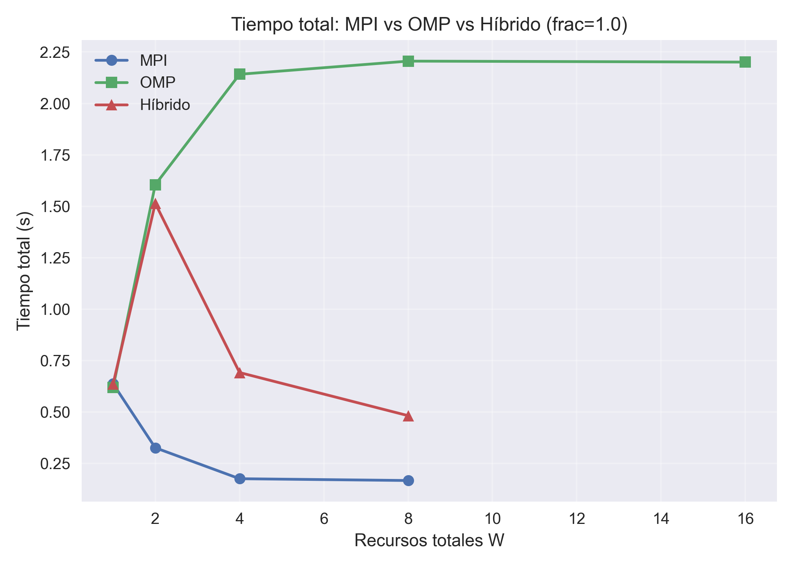
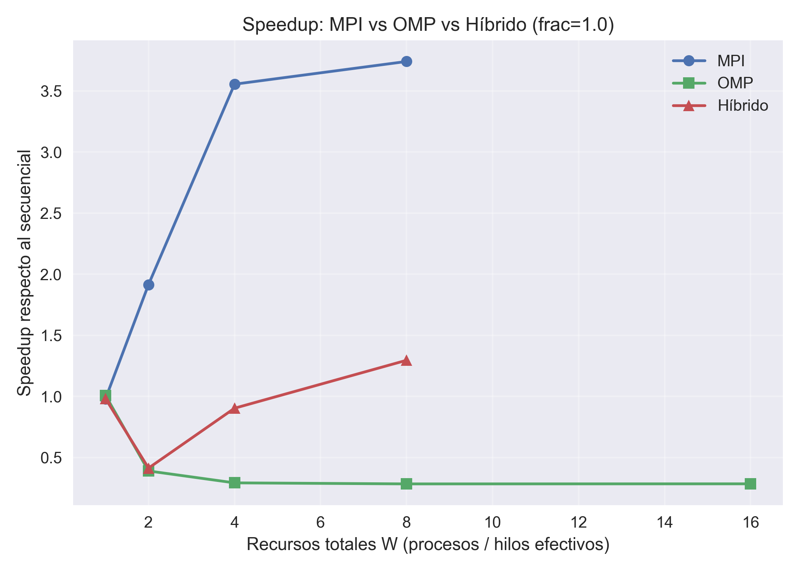
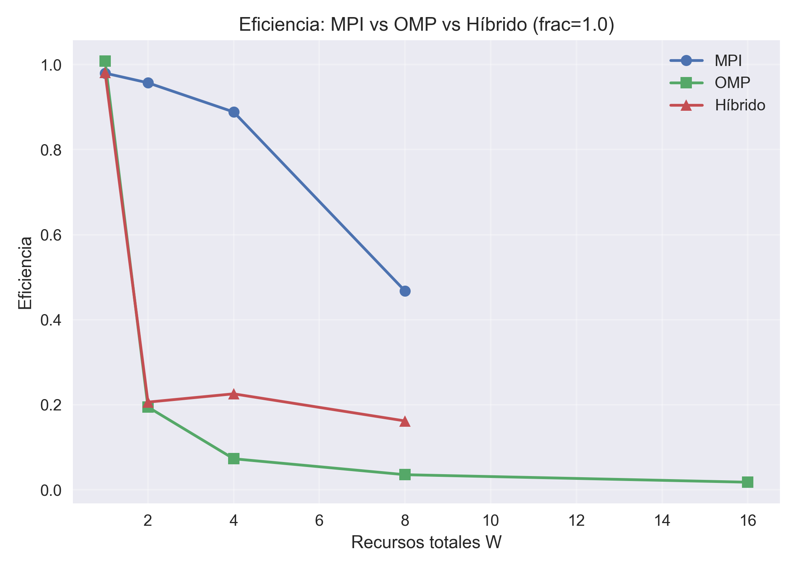
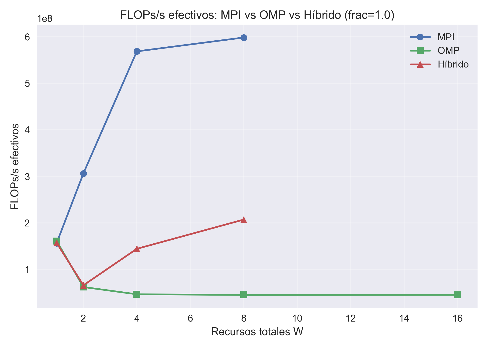

# KNN Paralelo con MPI, Threads e Híbrido

## Descripción General

Este proyecto implementa y analiza el algoritmo K-Nearest Neighbors (KNN) utilizando diferentes estrategias de paralelización sobre el dataset `load_digits` de scikit-learn (1797 muestras de dígitos manuscritos, 64 features por imagen 8x8).

Se implementan cuatro variantes:

- **Sequential**: Implementación secuencial de referencia en Python.
- **MPI**: Paralelización distribuida mediante paso de mensajes con `mpi4py`.
- **OMP-like**: Paralelización en memoria compartida con hilos usando `joblib` (prefer="threads"), emulando OpenMP.
- **Hybrid**: Combinación de MPI entre procesos y threads dentro de cada proceso.

El proyecto ejecuta experimentos de **strong scaling** (problema fijo, variar recursos) y **weak scaling** (problema escalado con recursos) para cada variante paralela, midiendo:

- Tiempo total de ejecución
- Tiempo de cómputo
- Tiempo de comunicación (MPI/Hybrid)
- Accuracy
- Speedup
- Eficiencia
- FLOPs/s efectivos

Los resultados se almacenan en archivos CSV con formato unificado y se generan gráficas comparativas.

## Requisitos y Dependencias

### Software Necesario

- **Python 3.8 o superior** (recomendado: Python 3.10+)
- **Implementación de MPI**: Microsoft MPI (Windows), MPICH u OpenMPI (Linux/macOS)

### Librerías Python

Las dependencias principales están listadas en `requirements.txt`:

- `numpy>=2.3.0`
- `scikit-learn>=1.7.0`
- `matplotlib>=3.10.0`
- `joblib>=1.5.0`
- `mpi4py>=4.1.0`

## Instalación del Entorno

### En Windows

#### 1. Instalar Python

Descarga Python desde [python.org](https://www.python.org/downloads/) y asegúrate de marcar la opción "Add Python to PATH" durante la instalación.

#### 2. Instalar Microsoft MPI

Descarga e instala ambos componentes de [MS-MPI v10.1.2](https://www.microsoft.com/en-us/download/details.aspx?id=100593):

- `msmpisetup.exe` (MS-MPI Runtime)
- `msmpisdk.msi` (MS-MPI SDK)

Verifica la instalación ejecutando en una terminal nueva:

```bash
mpiexec -help
```

#### 3. Clonar el Repositorio

```bash
git clone https://github.com/jeffHQ/parallel-knn.git
cd parallel-knn
```

#### 4. Crear Entorno Virtual

En PowerShell:

```powershell
python -m venv .venv
.\.venv\Scripts\Activate.ps1
```

En CMD:

```cmd
python -m venv .venv
.venv\Scripts\activate.bat
```

#### 5. Instalar Dependencias

```bash
pip install --upgrade pip
pip install -r requirements.txt
```

#### 6. Verificación

Verifica que las librerías principales están instaladas:

```bash
python -c "import numpy, sklearn, matplotlib, joblib; print('Paquetes básicos: OK')"
python -c "from mpi4py import MPI; print('mpi4py: OK')"
```

Prueba MPI con múltiples procesos:

```bash
mpiexec -n 4 python -c "from mpi4py import MPI; print(f'Rank {MPI.COMM_WORLD.rank}/{MPI.COMM_WORLD.size}')"
```

### En Linux/macOS

El proceso es similar, pero instala MPI usando el gestor de paquetes de tu sistema:

- **Ubuntu/Debian**: `sudo apt-get install mpich`
- **Fedora/RHEL**: `sudo dnf install mpich`
- **macOS (Homebrew)**: `brew install mpich`

Luego sigue los pasos 3-6 de la sección Windows (usando bash en lugar de PowerShell/CMD).

## Ejecución de los Experimentos

Todos los scripts deben ejecutarse desde el directorio `src/`:

```bash
cd src
```

### 1. Sequential (Baseline)

La versión secuencial es la referencia para calcular speedup y eficiencia.

```bash
python experiments/seq/experiments_seq.py --clear
```

**Opciones disponibles**:

- `--fractions 0.25 0.5 0.75 1.0`: Fracciones del dataset a usar
- `--k 3`: Número de vecinos
- `--clear`: Limpiar archivo de resultados antes de empezar

**Salida**: `results/seq/seq.csv`

### 2. MPI (Strong Scaling)

Ejecuta con diferentes números de procesos usando `mpiexec -n <p>`:

```bash
# Baseline (1 proceso)
mpiexec -n 1 python experiments/mpi/experiments_mpi_strong.py --clear

# 2 procesos
mpiexec -n 2 python experiments/mpi/experiments_mpi_strong.py

# 4 procesos
mpiexec -n 4 python experiments/mpi/experiments_mpi_strong.py

# 8 procesos
mpiexec -n 8 python experiments/mpi/experiments_mpi_strong.py

# 16 procesos
mpiexec -n 16 python experiments/mpi/experiments_mpi_strong.py
```

**Salida**: `results/mpi/mpi_strong.csv`

### 3. OMP-like (Strong Scaling)

Ejecuta con diferentes números de threads:

```bash
# Todos los threads de una vez
python experiments/omp/experiments_omp_strong.py --clear --threads-list 1 2 4 8 16
```

O ejecuta configuraciones individuales:

```bash
python experiments/omp/experiments_omp_strong.py --clear --threads-list 1
python experiments/omp/experiments_omp_strong.py --threads-list 2
python experiments/omp/experiments_omp_strong.py --threads-list 4
python experiments/omp/experiments_omp_strong.py --threads-list 8
python experiments/omp/experiments_omp_strong.py --threads-list 16
```

**Salida**: `results/omp/omp_strong.csv`

**Nota**: Debido al Global Interpreter Lock (GIL) de Python, el speedup con threads será sublineal.

### 4. Hybrid (Strong Scaling)

El método híbrido combina procesos MPI (`-n <p>`) y threads (`--threads <t>`), donde:

**Workers totales: W = p × threads**

Para alcanzar 16 workers, hay varias combinaciones posibles:

```bash
# W = 1 (baseline)
mpiexec -n 1 python experiments/hybrid/experiments_hybrid_strong.py --clear --threads 1

# W = 2
mpiexec -n 1 python experiments/hybrid/experiments_hybrid_strong.py --threads 2
# o:
mpiexec -n 2 python experiments/hybrid/experiments_hybrid_strong.py --threads 1

# W = 4
mpiexec -n 2 python experiments/hybrid/experiments_hybrid_strong.py --threads 2
# o:
mpiexec -n 4 python experiments/hybrid/experiments_hybrid_strong.py --threads 1

# W = 8
mpiexec -n 2 python experiments/hybrid/experiments_hybrid_strong.py --threads 4
# o:
mpiexec -n 4 python experiments/hybrid/experiments_hybrid_strong.py --threads 2

# W = 16
mpiexec -n 2 python experiments/hybrid/experiments_hybrid_strong.py --threads 8
# o:
mpiexec -n 4 python experiments/hybrid/experiments_hybrid_strong.py --threads 4
# o:
mpiexec -n 8 python experiments/hybrid/experiments_hybrid_strong.py --threads 2
```

**Salida**: `results/hybrid/hybrid_strong.csv`

### Weak Scaling

Para experimentos de weak scaling, usa los scripts correspondientes:

- MPI: `experiments/mpi/experiments_mpi_weak.py`
- OMP: `experiments/omp/experiments_omp_weak.py`
- Hybrid: `experiments/hybrid/experiments_hybrid_weak.py`

En weak scaling, el tamaño del problema escala proporcionalmente con el número de workers.

## Generar Gráficas

Una vez ejecutados todos los experimentos, genera las visualizaciones:

### Gráficas por Método

```bash
# Sequential
python experiments/seq/analyze_seq.py

# MPI
python experiments/mpi/analyze_mpi_strong.py
python experiments/mpi/analyze_mpi_weak.py

# OMP
python experiments/omp/analyze_omp_strong.py
python experiments/omp/analyze_omp_weak.py

# Hybrid
python experiments/hybrid/analyze_hybrid_strong.py
python experiments/hybrid/analyze_hybrid_weak.py
```

Las figuras se guardan en `results/figures/<método>/`.

### Comparación Global

Este script genera gráficas comparativas de todos los métodos paralelos:

```bash
python experiments/compare/compare_parallel_methods.py
```

**Salida**: `results/figures/compare/`

## Resultados

A continuación se muestran las gráficas comparativas generadas para los experimentos de strong scaling con el dataset completo (fracción = 1.0).

### Comparación de Tiempos de Ejecución



Comparación del tiempo total de ejecución entre las tres variantes paralelas (MPI, OMP-like, Hybrid) en función del número de workers.

### Comparación de Speedup



Speedup alcanzado por cada método paralelo respecto a la versión secuencial. El speedup ideal (lineal) se muestra como referencia.

### Comparación de Eficiencia



Eficiencia de paralelización (Speedup / Workers) para cada método. Una eficiencia del 100% indica escalado lineal ideal.

### Comparación de FLOPs/s Efectivos



Throughput efectivo (FLOPs por segundo) considerando todos los overheads de comunicación y sincronización.

## Estructura del Proyecto

```
parallel-knn/
├── README.md                    # Este archivo
├── requirements.txt             # Dependencias Python
├── src/
│   ├── core/                    # Módulos reutilizables
│   │   ├── knn_core.py          # Funciones KNN (distancias, vecinos, votación)
│   │   ├── data_utils.py        # Carga del dataset
│   │   ├── csv_utils.py         # Escritura de CSV
│   │   └── timing_utils.py      # Medición de tiempos y métricas
│   ├── methods/                 # Implementaciones KNN
│   │   ├── knn_sequential.py    # Versión secuencial
│   │   ├── knn_mpi.py           # Versión MPI
│   │   ├── knn_omp.py           # Versión OMP-like
│   │   └── knn_hybrid.py        # Versión híbrida
│   └── experiments/             # Scripts de experimentos y análisis
│       ├── seq/
│       ├── mpi/
│       ├── omp/
│       ├── hybrid/
│       └── compare/
└── results/                     # Resultados (CSV y gráficas)
    ├── seq/, mpi/, omp/, hybrid/
    └── figures/
        ├── seq/, mpi/, omp/, hybrid/
        └── compare/             # Gráficas comparativas
```

## Formato de Resultados

Todos los experimentos generan archivos CSV con el siguiente formato:

```
version,scaling,frac,n_train,n_test,k,p,threads,workers,accuracy,t_total,t_compute,t_comm,flops
```

Donde:

- `version`: sequential, mpi, omp, hybrid
- `scaling`: strong, weak
- `frac`: fracción del dataset utilizada
- `n_train`, `n_test`: tamaños de conjunto de entrenamiento y prueba
- `k`: número de vecinos
- `p`: número de procesos MPI
- `threads`: número de threads por proceso
- `workers`: total de workers (p × threads)
- `accuracy`: precisión de clasificación
- `t_total`, `t_compute`, `t_comm`: tiempos medidos (segundos)
- `flops`: FLOPs totales ejecutados

## Equipo

- Leandro J. Mamani (Desarrollo e implementación)

## Licencia

Este proyecto es de código abierto para fines educativos.

## Contacto

- Repositorio: [github.com/jeffHQ/parallel-knn](https://github.com/jeffHQ/parallel-knn)
- Autor: jeffHQ
